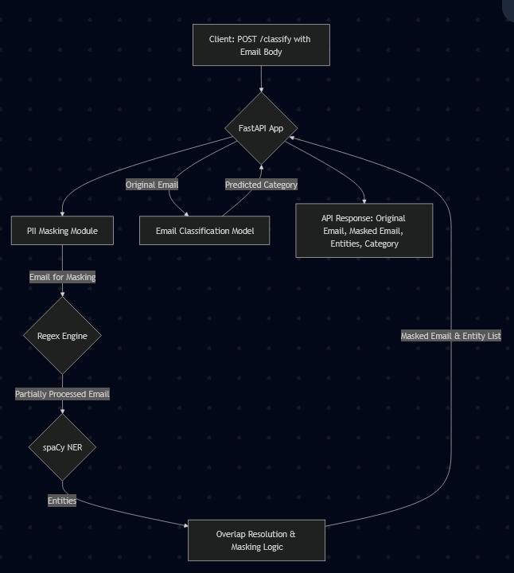
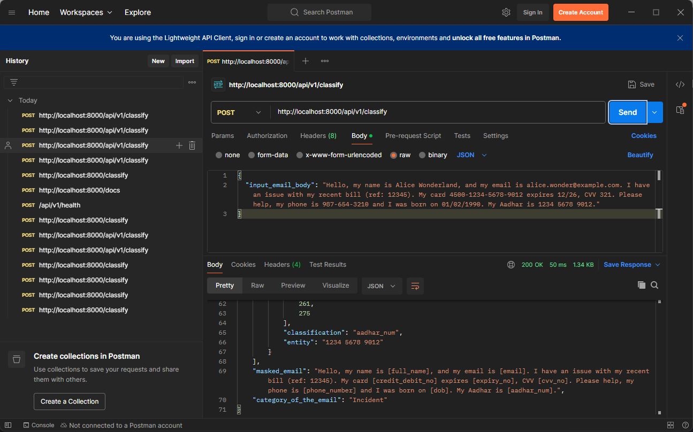
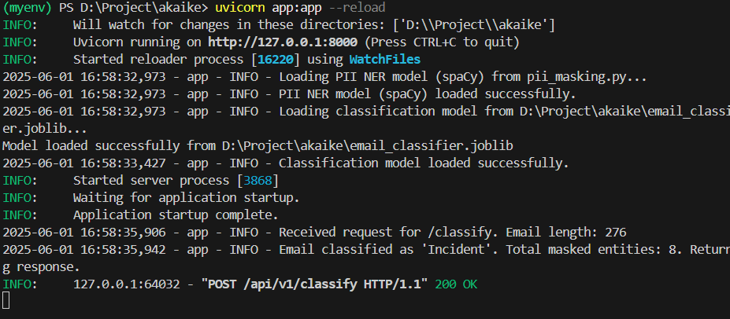

# 📧 EmailGuard: Intelligent Classification & PII Shield API

Welcome to EmailGuard created for Akaike by Nitin Prajwal! This project provides a robust API for classifying support emails and automatically masking sensitive Personally Identifiable Information (PII) and Payment Card Industry (PCI) data. It's designed to help support teams efficiently categorize inquiries while upholding strict data privacy standards.

[](https://www.python.org/)
[](https://fastapi.tiangolo.com/)
[](https://huggingface.co/spaces)

## ✨ Key Features

-   **🎯 Accurate Email Classification**: Automatically categorizes emails into **Incident, Request, Change, or Problem**.
-   **🛡️ Advanced PII Masking**: Leverages a hybrid approach (RegEx + spaCy NER) to detect and mask a comprehensive list of PII entities without relying on LLMs. Masked entities include:
    -   Full Names
    -   Email Addresses
    -   Phone Numbers
    -   Dates of Birth (DOB)
    -   Aadhar Numbers
    -   Credit/Debit Card Numbers
    -   CVV Numbers
    -   Card Expiry Dates
-   **🚀 FastAPI Powered**: Built with modern, high-performance FastAPI for a robust and scalable API.
-   **📦 Easy Deployment**: Designed for straightforward deployment on Hugging Face Spaces.
-   **🔍 Transparent Output**: Returns the original email, the masked email, and a detailed list of detected PII entities with their positions.

## 🏗️ System Architecture

The system follows a sequential processing pipeline:

1.  **API Request**: The user sends a POST request to the `/classify` endpoint with the raw email body.
2.  **PII Masking Module (`pii_masking.py`)**:
    *   The input email is first processed by a series of **Regular Expressions** tailored to identify common PII patterns (e.g., email formats, phone numbers, card numbers).
    *   Next, **spaCy's Named Entity Recognition (NER)** model (`en_core_web_sm`) is used to identify contextual PII like names and dates.
    *   A custom logic resolves overlaps between entities detected by RegEx and NER, prioritizing more specific or reliable detections.
    *   The identified PII is then replaced with generic placeholders (e.g., `[NAME]`, `[EMAIL_ADDRESS]`).
3.  **Email Classification Module (`app.py` using `email_classifier.joblib`)**:
    *   The *original* (unmasked) email body is fed into a pre-trained **scikit-learn pipeline** (`email_classifier.joblib`).
    *   This pipeline likely consists of a text vectorizer (e.g., TF-IDF) followed by a classifier (e.g., Logistic Regression, SVM, or Naive Bayes).
    *   The model predicts one of the four predefined categories.
4.  **API Response**: The system returns a JSON object containing:
    *   The original input email.
    *   A list of all PII entities found, including their type, original value, and position in the text.
    *   The email body with all PII entities masked.
    *   The predicted email category.



## 🛠️ Core Technologies & Algorithms

-   **FastAPI**: For building the asynchronous and high-performance API.
-   **Uvicorn**: ASGI server for running the FastAPI application.
-   **Python**: The core programming language.
-   **PII Detection & Masking**:
    -   **Regular Expressions (RegEx)**: Custom patterns in `pii_masking.py` for precise matching of structured PII like email addresses, phone numbers, credit card details, Aadhar numbers, etc.
    -   **spaCy (`en_core_web_sm`)**: Utilized for Named Entity Recognition (NER) to identify less structured PII such as person names (`PERSON`) and dates (`DATE`). The small English model is chosen for a balance of performance and resource usage.
    -   **Hybrid Approach**: Combines the strengths of RegEx (precision for patterns) and NER (contextual understanding) for comprehensive PII detection.
    -   **Overlap Resolution**: Custom logic to handle cases where RegEx and NER might identify overlapping entities, ensuring accurate masking.
-   **Email Classification**:
    -   **Scikit-learn**: The `email_classifier.joblib` is a pre-trained model/pipeline built using scikit-learn. This likely involves:
        -   **Text Vectorization**: Techniques like `TfidfVectorizer` or `CountVectorizer` to convert email text into numerical features.
        -   **Machine Learning Classifier**: A supervised learning algorithm (e.g., Logistic Regression, Naive Bayes, Support Vector Machine, or a simple ensemble) trained on the `combined_emails_with_natural_pii.csv` dataset.

## 📂 Project Structure

```
. (root)
├── app.py                     # Main FastAPI application
├── pii_masking.py             # PII detection and masking logic
├── classification_model.py    # Scripts for training/evaluating the classifier (not run by API)
├── config.py                  # Configuration settings
├── utils.py                   # Utility functions
├── test_pii_masking.py        # Unit tests for PII masking
├── requirements.txt           # Python dependencies
├── email_classifier.joblib    # Pre-trained classification model
├── combined_emails_with_natural_pii.csv # Dataset for training (large file)
├── README.md                  # This file
├── .gitignore                 # Git ignore rules
├── Procfile                   # For Hugging Face Spaces deployment
├── image.png                  # Example image (Postman test)
└── image-1.png                # Example image (Server running)
```

## 🚀 Setup and Running Locally

1.  **Clone the Repository**:
    ```bash
    git clone https://github.com/nitinprajwal/email-pii-classifier.git
    cd email-pii-classifier
    ```

2.  **Create Virtual Environment & Install Dependencies**:
    ```bash
    python -m venv venv
    # On macOS/Linux:
source venv/bin/activate
    # On Windows:
    # venv\Scripts\activate
    pip install -r requirements.txt
    ```
    *The `en_core_web_sm` spaCy model will be installed via `requirements.txt`.*

3.  **Ensure Model Availability**: The `email_classifier.joblib` file must be in the project root.

4.  **Run the Application**:
    ```bash
    uvicorn app:app --reload --host 0.0.0.0 --port 8000
    ```

5.  **Access the API**:
    -   **Interactive Docs (Swagger)**: [http://localhost:8000/docs](http://localhost:8000/docs)
    -   **Alternative Docs (ReDoc)**: [http://localhost:8000/redoc](http://localhost:8000/redoc)

## ⚙️ API Specification

**Endpoint**: `/classify`
**Method**: `POST`

**Request Body (JSON)**:

```json
{
  "input_email_body": "Your email text string, e.g., Hello, my name is John Doe, my email is john.doe@example.com and I need help with order 12345. My card 4111111111111111 expires 12/25 CVV 123. My DOB is 01/01/1990 and Aadhar is 123456789012."
}
```

**Successful Response (200 OK) Body (JSON)**:

```json
{
  "input_email_body": "Original email text...",
  "list_of_masked_entities": [
    {
      "position": [start_index, end_index],
      "classification": "entity_type", // e.g., "full_name", "email", "credit_debit_no"
      "entity": "original_entity_value"
    }
    // ... more entities
  ],
  "masked_email": "Email text with PII placeholders like [NAME] or [EMAIL_ADDRESS]...",
  "category_of_the_email": "Predicted_Category_Name" // e.g., "Incident", "Request"
}
```

## 🖼️ Demo & Usage Examples

Below are examples of the API in action:

**1. Testing with Postman:**
This image shows a sample request to the `/classify` endpoint using Postman and the corresponding successful response.



**2. Server Running Smoothly:**
This image confirms the Uvicorn server running the FastAPI application without errors.



## ☁️ Deployment on Hugging Face Spaces

This application is ready for deployment on Hugging Face Spaces:

1.  Ensure your GitHub repository (linked to your HF Space) includes all necessary files at the root (see Project Structure).
2.  The `Procfile` should contain:
    ```
    web: uvicorn app:app --host 0.0.0.0 --port $PORT
    ```
3.  Configure your Hugging Face Space for Python and link it to your GitHub repository.
4.  The API will be accessible at: `https://<your-username>-<your-space-name>.hf.space/classify`

## 💡 Future Enhancements

-   **Advanced Overlap Resolution**: Implement more sophisticated logic for PII entity overlap resolution.
-   **Customizable Masking**: Allow users to specify which PII types to mask.
-   **Batch Processing**: Add an endpoint for classifying and masking multiple emails in a single request.
-   **Model Monitoring**: Integrate logging and monitoring for model performance over time.
-   **Expanded PII Types**: Add support for more PII entities based on evolving requirements.

## 📄 Report

A detailed report covering methodology, evaluation, challenges, and future work can be provided separately if required for project submission.

---

*Feel free to contribute or raise issues!*